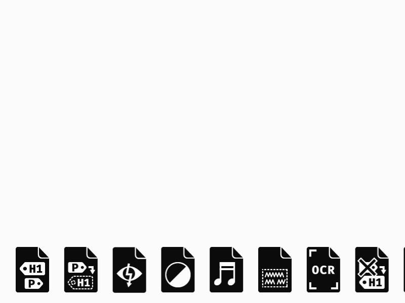

# Icons “Matterhorn Protocol”

This set of icons visualises some of the failure conditions of the Matterhorn Protocol. This document helps to test PDF documents for PDF/UA compliance. PDF/UA is the accessibility standard for PDF.

## License

[Creative Commons CC-BY 4.0](https://creativecommons.org/licenses/by/4.0/)